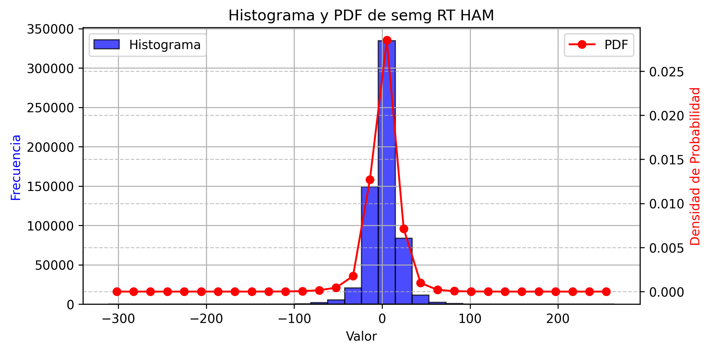
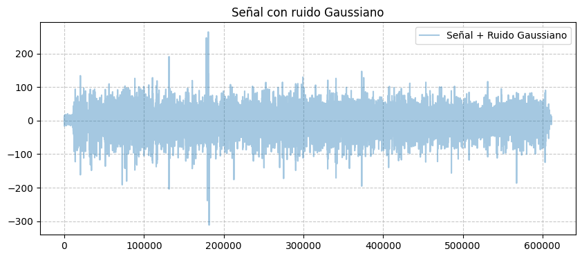
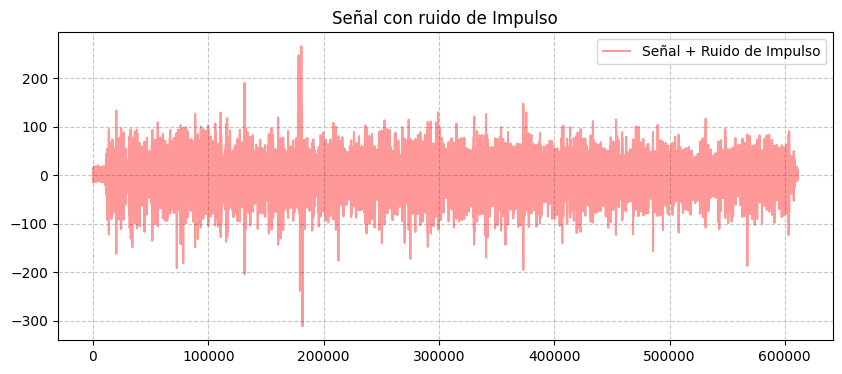
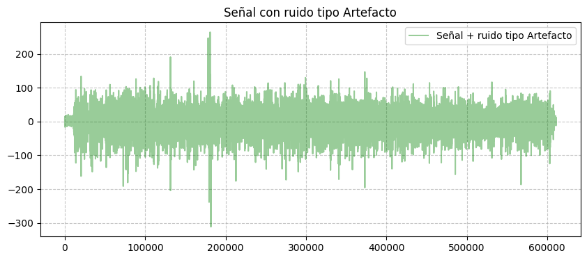
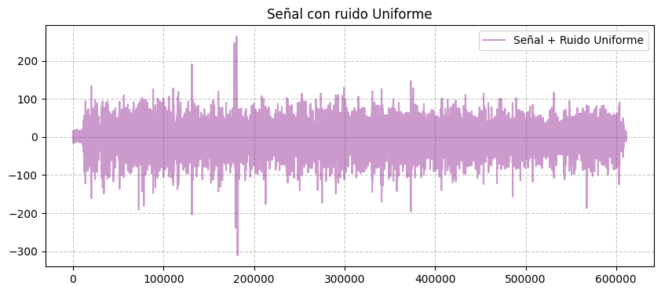
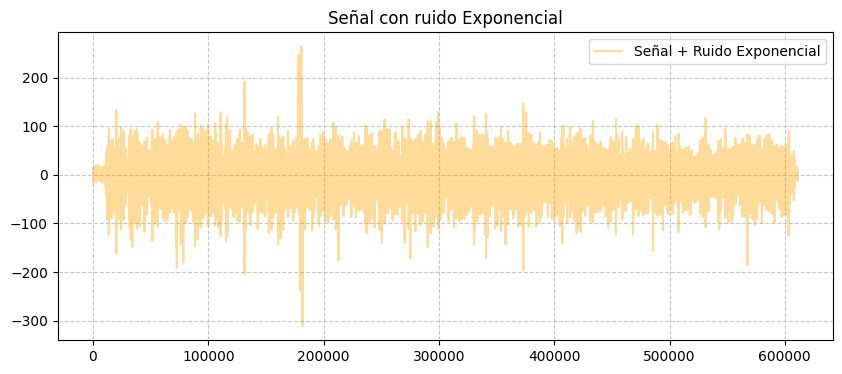
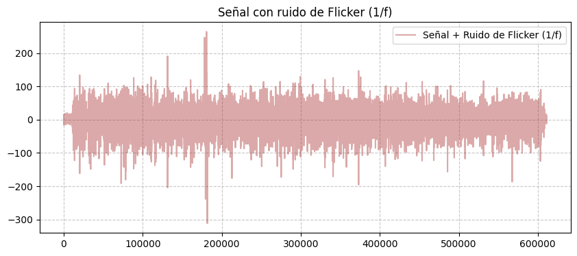

# Análisis estadístico de señal EMG en músculo Isquiotibial

## Descripción
En el presente laboratorio se realiza un análisis estadístico de una señal fisiológica del músculo isquitibial con el objetivo de identificar los estadisticos descriptivos. Para ello, se descarga 
la señal desde una base de datos, llamada physionet, se procesa y se implementa lenguaje de porgramación **Python**. Se programa manualmente y con funciones predeterminadas de la libreria de **numpy** para el calculo. Adicionalmente, se contamina la señal con distintos tipos de ruido para medir su impacto en la señal.

## Tener en cuenta
1. El sujeto caminó sobre un terreno llano durante 5 minutos a su velocidad y ritmo naturales.
2. Las señales sEMG se adquiere del musculo isquiotibiales (**Ham**).
3. Todas las señales se registran con una frecuencia de muestreo de **2 kHz**.
4. Se debe instalar las librerias:
   + Wfdb.
   + Numpy.
   + Pandas.
   + Matplotlib.
5. Se utiliza **Jupyter NoteBook** para dividir el código en partes y trabajar en ellas sin importar el orden: escribir, probar funciones, cargar un archivo en la memoria y procesar el contenido. Con lenguaje de **Python**
## Análisis de Datos con Jupyter Notebook

Este proyecto analiza datos de sensores biomédicos utilizando Python y bibliotecas como NumPy y Matplotlib.

### Código
Se importan las siguientes librerias para facilitar la ejecución del programa.
```python
## Librerías necesarias
import pandas as pd
import matplotlib.pyplot as plt
import wfdb
import numpy as np
```
>Tener en cuenta qué para leer el Archivo descargado del repositorio el directorio debe de tener los archivos .DAT y .HEA debio a que sin alguno de los dos la lectura fallará. Se recomienda tenerlos en la carpeta en donde está el Script de Python para no tener que buscarla por todo el equipo.
>
Seguido a eso se extrae el documento y con ayuda de la libreria de pandas se hace un DataFrame para visualizar mejor los datos del documento.
```python
record = wfdb.rdrecord('S01') #Exportar documento
frecuencia = 2000 #Dada en el documento 
num_muestra= 611001 #Dada en la data
tiempo= np.arange(0,num_muestra/frecuencia,1/frecuencia) #indica el incremento del tiempo para cada dato.
df_rt=df_01[['semg RT HAM']]
if len(tiempo) == len(df_rt):
    # Agregar la columna de tiempo al DataFrame
    df_rt["Tiempo (s)"] = tiempo

plt.figure(figsize=(17, 10))  # Configura el tamaño del gráfico
# Graficar la señal "semg RT HAM" en función del tiempo
plt.plot(df_rt["Tiempo (s)"], df_rt["semg RT HAM"], label="semg RT HAM", color="pink")
plt.title("Serie de Tiempo: sEMG RT HAM", fontsize=16)
plt.xlabel("Tiempo (s)", fontsize=14)
plt.ylabel("Amplitud (mV)", fontsize=14)
# Agregar una rejilla y la leyenda
plt.grid(True, linestyle="--", alpha=0.7)
plt.legend(fontsize=12)
plt.savefig("semg_RT_HAM.png", dpi=300, bbox_inches='tight')
```
### Gráfica Original

<br><em>Figura 1: señal sEMG RT HAM en función del tiempo .</em></p>


* Se observa que hay picos tanto positivos como negativos, lo que puede corresponder a la activación y relajación de los músculos.
* La persona realizó contracciones musculares por tanto estos cambios en amplitud reflejan la actividad eléctrica del músculo.
## Estadísticos descriptivos
Para realizar los analisis se hacen los calculos tanto manuales como por funciones predeterminadas como se indica en los comentarios del codigo.
```python
#CALCULO DE MEDIA
suma_total=0
media=0
for c in df_rt['semg RT HAM']:
    suma_total +=c
media=suma_total/len(df_rt['semg RT HAM']) #Manual
print("Media= " +str(media)) #STR ES PARA CONVERTIR A STRING

#Con función
np.mean(df_rt['semg RT HAM'])

#CALCULO PARA DESVIACION ESTANDAR
# Cálculo de las diferencias cuadradas
diferencia = [(x - media) ** 2 for x in df_rt['semg RT HAM']]
# Sumar las diferencias cuadradas
sumatoria_diferencia = sum(diferencia)
# Calcular la varianza (muestral)
varianza = sumatoria_diferencia / (len(df_rt['semg RT HAM']) - 1)
# Calcular la desviación estándar
desviacion = varianza ** 0.5 #Manual
print("Varianza: " + str(varianza))
print("Desviación estándar: " + str(desviacion))

#Con funcion
np.std(df_rt['semg RT HAM'])

#CALCULO COEFICIENTE DE VARIACION
cv=(desviacion/media)*100
print("Coeficiente de variación= "+str (cv))
```
**Resultados**
| Media | Desviación Estandar  | Varianza | Coeficiente Variación|
|:-------:|:-----------------:|:----------:|:-----------------:|
| 1.956 |      16.347     | 267.237  |       835.349   |


Posterior a estos resultados, se realizó el histograma con la función de probabilidad de la siguiente manera:
```python
# HISTOGRAMA
# Datos de la columna (eliminamos NaN)
data = df_01[columna].dropna()
# Crear la figura
plt.figure(figsize=(8, 4))

# Graficar el histograma con Pandas (sin normalización)
ax = df_01[columna].hist(bins=30, alpha=0.7, color='blue', edgecolor='black', density=False, label='Histograma')

# Calcular histograma normalizado para la PDF
counts, bins = np.histogram(data, bins=30, density=True)

# Calcular centros de bins
bin_centers = (bins[:-1] + bins[1:]) / 2

# Graficar la función de densidad de probabilidad (PDF) sobre el histograma
ax2 = ax.twinx()  # Crear segundo eje para PDF
ax2.plot(bin_centers, counts, marker='o', linestyle='-', color='red', label='PDF')

# Etiquetas
ax.set_xlabel('Valor')
ax.set_ylabel('Frecuencia', color='blue')
ax2.set_ylabel('Densidad de Probabilidad', color='red')

# Agregar leyendas
ax.legend(loc='upper left')
ax2.legend(loc='upper right')

# Mostrar la gráfica
plt.title(f'Histograma y PDF de {columna}')
plt.grid(axis='y', linestyle='--', alpha=0.7)
plt.show()
```
Obteniendo lo siguiente :

<br><em>Figura 2: Histograma con función de probabilidad de la señal sEMG RT HAM .</em></p>

### SNR 

Se contamina la señal con diferentes tipos de ruidos diferentes para medir la relación señal ruido. Esto es debido a que la SNR es relevante en la interpretacion de señales biomedicas ya que compara entre el nivel de un detalle deseado (la señal) y el nivel de detalles no deseados, generalmente interferencias o distorsiones (el ruido).La SNR es un indicador de calidad de la señal, donde un mayor valor sugiere una mejor calidad de la información obtenida, mientras que un valor menor podría indicar una dificultad para comprender la señal de interés del ruido de fondo[¹](#1).
Se utilizaron 6 tipos de ruidos diferentes y se grafico la señal como se observa en los codigos 

 1. Ruido Gaussiano
```python
# Copia de la señal original
señal = df_rt['semg RT HAM'].values  

# Generación de ruido Gaussiano
rgauss = np.random.normal(0, 0.05, len(señal))  
señalruidog = señal + rgauss  

# Agregar al DataFrame sin warning
df_rt.loc[:, 'Rgaussiano'] = señalruidog  

# Graficar
plt.figure(figsize=(10, 4))
plt.plot(señalruidog, label="Señal + Ruido Gaussiano", alpha=0.4)
plt.legend()
plt.title("Señal con ruido Gaussiano")

# Agregar rejilla
plt.grid(True, linestyle="--", alpha=0.7)
plt.show()

```

<br><em>Figura 3: señal original con Ruido Gaussiano  .</em></p>


 2.Ruido de impulso
```python
# Copia de la señal original
señal2 = df_rt['semg RT HAM'].values  
amplitud=1

# Generación de ruido de impulso
rimpulso = np.zeros_like(señal2)
indices_impulso = np.random.rand(len(señal2)) < 0.3 #0.3 es la probabilidad de impulso 30%
rimpulso[indices_impulso] = np.random.choice([-amplitud, amplitud], np.sum(indices_impulso))

# Señal con ruido de impulso
señalruidoi = señal2 + rimpulso

# Agregar al DataFrame sin warning
df_rt.loc[:, 'Rimpulso'] = señalruidoi 

# Graficar
plt.figure(figsize=(10, 4))
plt.plot(señalruidoi, label="Señal + Ruido de Impulso", alpha=0.4, color='red')
plt.legend()
plt.title("Señal con ruido de Impulso")

# Agregar rejilla
plt.grid(True, linestyle="--", alpha=0.7)
plt.show()
```

<br><em>Figura 4: señal original con Ruido de Impulso  .</em></p>

 3. Ruido de tipo de artefacto 

```python
# Copia de la señal original
señal3 = df_rt['semg RT HAM'].values  

# Parámetros del ruido tipo artefacto
frecart = 50  # Frecuencia de la interferencia (en Hz)
amplart = 0.1  # Amplitud de la interferencia
muestras_transitorias = 50  # Duración de los transitorios (en muestras)
ampltrans = 0.3  # Amplitud de los transitorios
probtrans = 0.005  # Probabilidad de ocurrencia de transitorios

# Generación de ruido tipo artefacto
tiempo = np.arange(len(señal3))
ruido_periodico = amplart * np.sin(2 * np.pi * frecart * tiempo / len(tiempo))

# Generación de transitorios
ruido_transitorio = np.zeros_like(señal3)
indices_transitorios = np.random.rand(len(señal3)) < probtrans
ruido_transitorio[indices_transitorios] = ampltrans * np.random.randn(np.sum(indices_transitorios))

# Combinación de ruido periódico y transitorio
rartefacto = ruido_periodico + ruido_transitorio

# Señal con ruido tipo artefacto
señalruidoartefacto = señal3 + rartefacto

# Agregar al DataFrame sin warning
df_rt.loc[:, 'Rartefacto'] = señalruidoartefacto  

# Graficar
plt.figure(figsize=(10, 4))
plt.plot(señalruidoartefacto, label="Señal + ruido tipo Artefacto", alpha=0.4, color='green')
plt.legend()
plt.title("Señal con ruido tipo Artefacto")

# Agregar rejilla
plt.grid(True, linestyle="--", alpha=0.7)
plt.show()
```

<br><em>Figura 3: señal original con Ruido de Artefacto  .</em></p>

 4. Ruido uniforme
```python
# Copia de la señal original
señal4 = df_rt['semg RT HAM'].values 
# Parámetros del ruido uniforme
amplitud_uniforme = 0.1  # Amplitud del ruido uniforme

# Generación de ruido uniforme
runiforme = np.random.uniform(-amplitud_uniforme, amplitud_uniforme, len(señal4))

# Señal con ruido uniforme
señalruidouniforme = señal4 + runiforme

# Agregar al DataFrame sin warning
df_rt.loc[:, 'Runiforme'] = señalruidouniforme  

# Graficar
plt.figure(figsize=(10, 4))
plt.plot(señalruidouniforme, label="Señal + Ruido Uniforme", alpha=0.4, color='purple')
plt.legend()
plt.title("Señal con ruido Uniforme")

# Agregar rejilla
plt.grid(True, linestyle="--", alpha=0.7)
plt.show()
```

<br><em>Figura 5: señal original con Ruido Uniforme  .</em></p>

 5.Ruido exponencial
```python
# Copia de la señal original
señal5 = df_rt['semg RT HAM'].values 
# Parámetros del ruido exponencial
escala_exponencial = 0.05  # Parámetro de escala para la distribución exponencial

# Generación de ruido exponencial
rexponencial = np.random.exponential(escala_exponencial, len(señal5)) - escala_exponencial

# Señal con ruido exponencial
señalruidoexponencial = señal5 + rexponencial

# Agregar al DataFrame sin warning
df_rt.loc[:, 'Rexponencial'] = señalruidoexponencial  

# Graficar
plt.figure(figsize=(10, 4))
plt.plot(señalruidoexponencial, label="Señal + Ruido Exponencial", alpha=0.4, color='orange')
plt.legend()
plt.title("Señal con ruido Exponencial")

# Agregar rejilla
plt.grid(True, linestyle="--", alpha=0.7)
plt.show()
```

<br><em>Figura 6: señal original con Ruido Exponencial .</em></p>

 6. Ruido flicker 1/F
```python
# Copia de la señal original
señal6 = df_rt['semg RT HAM'].values # Parámetros del ruido de flicker
beta = 1  # Exponente de la ley de potencia (1/f^beta)

# Generación de ruido de flicker
frecuencias = np.fft.fftfreq(len(señal6))
espectro = 1 / (np.abs(frecuencias) ** (beta / 2) + 1e-10)  # Evitar división por cero
espectro[0] = 0  # Eliminar componente DC
ruido_flicker = np.fft.ifft(espectro * np.exp(1j * np.random.uniform(0, 2 * np.pi, len(señal6))))
ruido_flicker = np.real(ruido_flicker)  # Tomar la parte real

# Normalizar el ruido
rflicker = ruido_flicker / np.max(np.abs(ruido_flicker)) * 0.1  # Ajustar amplitud

# Señal con ruido de flicker
señalruidoflicker = señal + rflicker

# Agregar al DataFrame sin warning
df_rt.loc[:, 'Rflicker'] = señalruidoflicker  

# Graficar
plt.figure(figsize=(10, 4))
plt.plot(señalruidoflicker, label="Señal + Ruido de Flicker (1/f)", alpha=0.4, color='brown')
plt.legend()
plt.title("Señal con ruido de Flicker (1/f)")

# Agregar rejilla
plt.grid(True, linestyle="--", alpha=0.7)
plt.show()
```

<br><em>Figura 7: señal original con Ruido Flicker  .</em></p>

A partir de lo anterior, se calculó el SNR de cada uno de los ruido de la siguiente manera 
```python
# Calcular la potencia de la señal y del ruido
P_señal = np.mean(señalruidog ** 2)  # Potencia de la señal
P_ruido = np.mean(rgauss ** 2)   # Potencia del ruido

# Calcular SNR en decibeles (dB)
SNRGauss = 10 * np.log10(P_señal / P_ruido)
print("SNR señal ruido Gauss: " + str(SNRGauss) + " dB") 
```


## Referencias

1.Qué es Señal-Ruido. Diccionario Médico. Clínica U. Navarra. (n.d.).https://www.cun.es. Retrieved February 5, 2025, from https://www.cun.es/diccionario-medico/terminos/senal-ruido [¹](https://www.cun.es/diccionario-medico/terminos/senal-ruido) 


