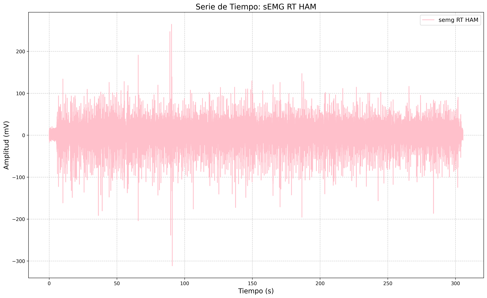

# Análisis estadístico de señal EMG en músculo Isquiotibial

## Descripción
En el presente laboratorio se realiza un análisis estadístico de una señal fisiológica del músculo isquitibial con el objetivo de identificar los estadisticos descriptivos. Para ello, se descarga 
la señal desde una base de datos, llamada physionet, se procesa y se implementa lenguaje de porgramación **Python**. Se programa manualmente y con funciones predeterminadas de la libreria de **numpy** para el calculo. Adicionalmente, se contamina la señal con distintos tipos de ruido para medir su impacto en la señal.

## Tener en cuenta
1. El sujeto caminó sobre un terreno llano durante 5 minutos a su velocidad y ritmo naturales.
2. Las señales sEMG se adquiere del musculo isquiotibiales (**Ham**).
3. Todas las señales se registran con una frecuencia de muestreo de **2 kHz**.
4. Se debe instalar las librerias:
   + Wfdb.
   + Numpy.
   + Pandas.
   + Matplotlib.
5. Se utiliza **Jupyter NoteBook** para dividir el código en partes y trabajar en ellas sin importar el orden: escribir, probar funciones, cargar un archivo en la memoria y procesar el contenido. Con lenguaje de **Python**
## Análisis de Datos con Jupyter Notebook

Este proyecto analiza datos de sensores biomédicos utilizando Python y bibliotecas como NumPy y Matplotlib.

### Código
Se importan las siguientes librerias para facilitar la ejecución del programa.
```python
## Librerías necesarias
import pandas as pd
import matplotlib.pyplot as plt
import wfdb
import numpy as np
```
>Tener en cuenta qué para leer el Archivo descargado del repositorio el directorio debe de tener los archivos .DAT y .HEA debio a que sin alguno de los dos la lectura fallará. Se recomienda tenerlos en la carpeta en donde está el Script de Python para no tener que buscarla por todo el equipo.
>
Seguido a eso se extrae el documento y con ayuda de la libreria de pandas se hace un DataFrame para visualizar mejor los datos del documento.
```python
record = wfdb.rdrecord('S01') #Exportar documento
frecuencia = 2000 #Dada en el documento 
num_muestra= 611001 #Dada en la data
tiempo= np.arange(0,num_muestra/frecuencia,1/frecuencia) #indica el incremento del tiempo para cada dato.
df_rt=df_01[['semg RT HAM']]
if len(tiempo) == len(df_rt):
    # Agregar la columna de tiempo al DataFrame
    df_rt["Tiempo (s)"] = tiempo

plt.figure(figsize=(17, 10))  # Configura el tamaño del gráfico
# Graficar la señal "semg RT HAM" en función del tiempo
plt.plot(df_rt["Tiempo (s)"], df_rt["semg RT HAM"], label="semg RT HAM", color="pink")
plt.title("Serie de Tiempo: sEMG RT HAM", fontsize=16)
plt.xlabel("Tiempo (s)", fontsize=14)
plt.ylabel("Amplitud (mV)", fontsize=14)
# Agregar una rejilla y la leyenda
plt.grid(True, linestyle="--", alpha=0.7)
plt.legend(fontsize=12)
plt.savefig("semg_RT_HAM.png", dpi=300, bbox_inches='tight')
```
### Gráfica Original



* Se observa que hay picos tanto positivos como negativos, lo que puede corresponder a la activación y relajación de los músculos.
* La persona realizó contracciones musculares por tanto estos cambios en amplitud reflejan la actividad eléctrica del músculo.
## Estadísticos descriptivos
Para realizar los analisis se hacen los calculos tanto manuales como por funciones predeterminadas como se indica en los comentarios del codigo.
```python
#CALCULO DE MEDIA
suma_total=0
media=0
for c in df_rt['semg RT HAM']:
    suma_total +=c
media=suma_total/len(df_rt['semg RT HAM']) #Manual
print("Media= " +str(media)) #STR ES PARA CONVERTIR A STRING

#Con función
np.mean(df_rt['semg RT HAM'])

#CALCULO PARA DESVIACION ESTANDAR
# Cálculo de las diferencias cuadradas
diferencia = [(x - media) ** 2 for x in df_rt['semg RT HAM']]
# Sumar las diferencias cuadradas
sumatoria_diferencia = sum(diferencia)
# Calcular la varianza (muestral)
varianza = sumatoria_diferencia / (len(df_rt['semg RT HAM']) - 1)
# Calcular la desviación estándar
desviacion = varianza ** 0.5 #Manual
print("Varianza: " + str(varianza))
print("Desviación estándar: " + str(desviacion))

#Con funcion
np.std(df_rt['semg RT HAM'])

#CALCULO COEFICIENTE DE VARIACION
cv=(desviacion/media)*100
print("Coeficiente de variación= "+str (cv))
```
**Resultados**
| Media | Desviación Estandar  | Varianza | Coeficiente Variación|
|:-------:|:-----------------:|:----------:|:-----------------:|
| 1.956 |      16.347     | 267.237  |       835.349   |

Posterior a estos resultados, se realizó el histograma con la funcion de probabilidad de la siguiente manera:
```python
# HISTOGRAMA
# Datos de la columna (eliminamos NaN)
data = df_01[columna].dropna()
# Crear la figura
plt.figure(figsize=(8, 4))

# Graficar el histograma con Pandas (sin normalización)
ax = df_01[columna].hist(bins=30, alpha=0.7, color='blue', edgecolor='black', density=False, label='Histograma')

# Calcular histograma normalizado para la PDF
counts, bins = np.histogram(data, bins=30, density=True)

# Calcular centros de bins
bin_centers = (bins[:-1] + bins[1:]) / 2

# Graficar la función de densidad de probabilidad (PDF) sobre el histograma
ax2 = ax.twinx()  # Crear segundo eje para PDF
ax2.plot(bin_centers, counts, marker='o', linestyle='-', color='red', label='PDF')

# Etiquetas
ax.set_xlabel('Valor')
ax.set_ylabel('Frecuencia', color='blue')
ax2.set_ylabel('Densidad de Probabilidad', color='red')

# Agregar leyendas
ax.legend(loc='upper left')
ax2.legend(loc='upper right')

# Mostrar la gráfica
plt.title(f'Histograma y PDF de {columna}')
plt.grid(axis='y', linestyle='--', alpha=0.7)
plt.show()
```
Obteniendo la siguiente grafica:
### Gráfica Original

