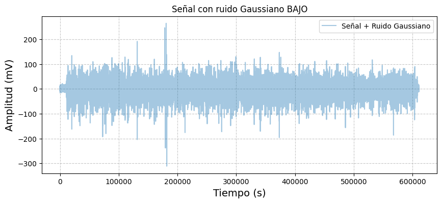

# Análisis estadístico de señal EMG en músculo Isquiotibial

## Descripción
En el presente laboratorio se realiza un análisis estadístico de una señal fisiológica del músculo isquitiobial con el objetivo de identificar los estadisticos descriptivos. Para ello, se descarga 
la señal desde una base de datos, llamada physionet, se procesa y se implementa lenguaje de porgramación **Python**. Se programa manualmente y con funciones predeterminadas de la libreria de **numpy** para el calculo. Adicionalmente, se contamina la señal con distintos tipos de ruido para medir su impacto en la señal.

## Tener en cuenta
1. El sujeto caminó sobre un terreno llano durante 5 minutos a su velocidad y ritmo naturales.
2. Las señales sEMG se adquiere del musculo isquiotibiales (**Ham**).
3. Todas las señales se registran con una frecuencia de muestreo de **2 kHz**.
4. Se debe instalar las librerias:
   + Wfdb.
   + Numpy.
   + Pandas.
   + Matplotlib.
5. Se utiliza **Jupyter NoteBook** para dividir el código en partes y trabajar en ellas sin importar el orden: escribir, probar funciones, cargar un archivo en la memoria y procesar el contenido. Con lenguaje de **Python**
## Análisis de Datos con Jupyter Notebook

Este proyecto analiza datos de sensores biomédicos utilizando Python y bibliotecas como NumPy y Matplotlib.

### Código
Se importan las siguientes librerias para facilitar la ejecución del programa.
```python
## Librerías necesarias
import pandas as pd
import matplotlib.pyplot as plt
import wfdb
import numpy as np
```
>Tener en cuenta qué para leer el Archivo descargado del repositorio el directorio debe de tener los archivos .DAT y .HEA debio a que sin alguno de los dos la lectura fallará. Se recomienda tenerlos en la carpeta en donde está el Script de Python para no tener que buscarla por todo el equipo.
>
Seguido a eso se extrae el documento y con ayuda de la libreria de pandas se hace un DataFrame para visualizar mejor los datos del documento.
```python
record = wfdb.rdrecord('S01') #Exportar documento
frecuencia = 2000 #Dada en el documento 
num_muestra= 611001 #Dada en la data
tiempo= np.arange(0,num_muestra/frecuencia,1/frecuencia) #indica el incremento del tiempo para cada dato.
df_rt=df_01[['semg RT HAM']]
if len(tiempo) == len(df_rt):
    # Agregar la columna de tiempo al DataFrame
    df_rt["Tiempo (s)"] = tiempo

plt.figure(figsize=(17, 10))  # Configura el tamaño del gráfico
# Graficar la señal "semg RT HAM" en función del tiempo
plt.plot(df_rt["Tiempo (s)"], df_rt["semg RT HAM"], label="semg RT HAM", color="pink")
plt.title("Serie de Tiempo: sEMG RT HAM", fontsize=16)
plt.xlabel("Tiempo (s)", fontsize=14)
plt.ylabel("Amplitud (mV)", fontsize=14)
# Agregar una rejilla y la leyenda
plt.grid(True, linestyle="--", alpha=0.7)
plt.legend(fontsize=12)
plt.savefig("semg_RT_HAM.png", dpi=300, bbox_inches='tight')
```
### Gráfica Original

<br><em>Figura 1: señal sEMG RT HAM en función del tiempo .</em></p>


* Se observa que hay picos tanto positivos como negativos, lo que puede corresponder a la activación y relajación de los músculos.
* La persona realizó contracciones musculares por tanto estos cambios en amplitud reflejan la actividad eléctrica del músculo.
## Estadísticos descriptivos
Para realizar los analisis se hacen los calculos tanto manuales como por funciones predeterminadas como se indica en los comentarios del codigo.
```python
#CALCULO DE MEDIA
suma_total=0
media=0
for c in df_rt['semg RT HAM']:
    suma_total +=c
media=suma_total/len(df_rt['semg RT HAM']) #Manual
print("Media= " +str(media)) #STR ES PARA CONVERTIR A STRING

#Con función
np.mean(df_rt['semg RT HAM'])

#CALCULO PARA DESVIACION ESTANDAR
# Cálculo de las diferencias cuadradas
diferencia = [(x - media) ** 2 for x in df_rt['semg RT HAM']]
# Sumar las diferencias cuadradas
sumatoria_diferencia = sum(diferencia)
# Calcular la varianza (muestral)
varianza = sumatoria_diferencia / (len(df_rt['semg RT HAM']) - 1)
# Calcular la desviación estándar
desviacion = varianza ** 0.5 #Manual
print("Varianza: " + str(varianza))
print("Desviación estándar: " + str(desviacion))

#Con funcion
np.std(df_rt['semg RT HAM'])

#CALCULO COEFICIENTE DE VARIACION
cv=(desviacion/media)*100
print("Coeficiente de variación= "+str (cv))
```
**Resultados**
| Media de datos | Desviación Estandar  | Varianza | Coeficiente Variación|
|:-------:|:-----------------:|:----------:|:-----------------:|
| 1.956 |      16.347     | 267.237  |       835.349   |


Posterior a estos resultados, se realizó el histograma con la función de probabilidad de la siguiente manera:
```python
# HISTOGRAMA
# Datos de la columna (eliminamos NaN)
data = df_01[columna].dropna()
# Crear la figura
plt.figure(figsize=(8, 4))

# Graficar el histograma con Pandas (sin normalización)
ax = df_01[columna].hist(bins=30, alpha=0.7, color='blue', edgecolor='black', density=False, label='Histograma')

# Calcular histograma normalizado para la PDF
counts, bins = np.histogram(data, bins=30, density=True)

# Calcular centros de bins
bin_centers = (bins[:-1] + bins[1:]) / 2

# Graficar la función de densidad de probabilidad (PDF) sobre el histograma
ax2 = ax.twinx()  # Crear segundo eje para PDF
ax2.plot(bin_centers, counts, marker='o', linestyle='-', color='red', label='PDF')

# Etiquetas
ax.set_xlabel('Valor')
ax.set_ylabel('Frecuencia', color='blue')
ax2.set_ylabel('Densidad de Probabilidad', color='red')

# Agregar leyendas
ax.legend(loc='upper left')
ax2.legend(loc='upper right')

# Mostrar la gráfica
plt.title(f'Histograma y PDF de {columna}')
plt.grid(axis='y', linestyle='--', alpha=0.7)
plt.show()
```
Obteniendo lo siguiente :


<br><em>Figura 2: Histograma con función de probabilidad de la señal sEMG RT HAM .</em></p>


+ La forma de la distribución es aproximadamente simétrica alrededor de cero, lo cual es una característica de la distribución normal.
+ La mayor parte de los datos están concentrados en un rango estrecho, similar a la campana de Gauss.

## Relación señal/ruido 

Se contamina la señal con diferentes tipos de ruidos diferentes para medir la relación señal ruido. Esto es debido a que la SNR es relevante en la interpretación de señales biomedicas ya que compara entre el nivel de un detalle deseado (la señal) y el nivel de detalles no deseados, generalmente interferencias o distorsiones (el ruido).La SNR es un indicador de calidad de la señal, donde un mayor valor sugiere una mejor calidad de la información obtenida, mientras que un valor menor podría indicar una dificultad para comprender la señal de interés del ruido de fondo[¹](#1).Por otra parte, la SNR es igual a la relacion entre la intensidad promedio de la señla y la desviacion estandar el ruido.[2]

Se emplearon tres tipos diferentes de ruido, y para cada uno se realizaron pruebas con dos niveles de intensidad: ruido bajo y ruido alto, como se muestra a continuación.

 + 1. Ruido Gaussiano
+ El ruido gaussiano es un tipo de ruido aleatorio cuya distribución de amplitud sigue una curva normal o gaussiana, es el mas importante en la rama estadistica ya que su curva indica la mayor exatitud los fenomenos que suceden en la naturaleza.
    
+ 1.1 Ruido Gaussiano bajo
+ Primero, se extrae la columna del data frame y se convierten los valores a un arreglo con *.values*, el cual se va a llamar señal
+ Despues,se genera el ruido gaussiano con la función random normal ya que genera valores aleatorios con distribución normal (valor medio, desviación o dispersión de los valores, tamaño del arreglo) si se aumenta el segundo valor, aumenta la dispersión y por lo tanto el ruido
+ Por ultimo,se suma la señal original con la del ruido.
  
```python
## RUIDO GAUSSIANO CON DESVIACIÓN BAJA 0.5

# Copia de la señal original
señal = df_rt['semg RT HAM'].values  

# Generación de ruido Gaussiano
rgauss = np.random.normal(0, 0.5, len(señal))  
señalruidog = señal + rgauss   

# Graficar
plt.figure(figsize=(10, 4))
plt.plot(señalruidog, label="Señal + Ruido Gaussiano", alpha=0.4)
plt.legend()
plt.title("Señal con ruido Gaussiano BAJO")
plt.xlabel("Tiempo (s)", fontsize=14)
plt.ylabel("Amplitud (mV)", fontsize=14)
# Agregar rejilla
plt.grid(True, linestyle="--", alpha=0.7)
plt.show()

```

<br><em>Figura 3: señal original contaminada con Ruido Gaussiano con una amplitud baja .</em></p>

 + 1.2 Ruido Gaussiano alto
 + Aqui se realiza el mismo procedimiento anterior, solo que se cambia la dispersión de los datos para que asi se genere mas ruido.
```python
## RUIDO GAUSSIANO CON DESVIACIÓN ALTA 50

# Copia de la señal original
señal = df_rt['semg RT HAM'].values  

# Generación de ruido Gaussiano
rgauss2 = np.random.normal(0, 50, len(señal))  
señalruidog2 = señal + rgauss2   

# Graficar
plt.figure(figsize=(10, 4))
plt.plot(señalruidog2, label="Señal + Ruido Gaussiano", alpha=0.4, color='blue')
plt.legend()
plt.title("Señal con ruido Gaussiano ALTO")
plt.xlabel("Tiempo (s)", fontsize=14)
plt.ylabel("Amplitud (mV)", fontsize=14)

# Agregar rejilla
plt.grid(True, linestyle="--", alpha=0.7)
plt.show()

```

<br><em>Figura 3: señal original contaminada con Ruido Gaussiano con una amplitud alta .</em></p>

+ 2. Ruido de impulso
El ruido de impulso consiste en picos de alta intensidad que aparecen de manera abrupta en una señal, alterando valores específicos sin afectar el resto. Es característico de interferencias eléctricas o fallos en la transmisión de datos.
+ 2.1 .Ruido de impulso bajo 
Este ruido genera ruidos en los picos grandes, positivos o negativos que aparecen ineperadamente y no siguen un patron.
+ Primero se toma los valores del dataframe y se convierten en un arreglo llamado señal2, en este caso.
+ Luego, se define la amplitud del ruido, es decir, los picos que va a tener, si se le aumenta el valor, el ruido va a ser mayor.
+ Después, se crea un vector vacío con solo 0 del tamaño de la señal2
>*indices_impulso* es un vector modo booleano que asigna valores 1 o 0 (true or false), agrega el true solo al 30% de los datos>
+ Ahora al vector vacío llamado rimpulso, al 30% de valores true( lo hace *np.sum*) le va a asignar un valor random entre los valores elegidos para la amplitud
+ Finalmente, se suma la señal original con la generada del ruido.
  
 ```python

##RUIDO DE IMPULSO CON AMPLITUD BAJA
# Copia de la señal original
señal2 = df_rt['semg RT HAM'].values  
amplitud=0.1

# Generación de ruido de impulso
rimpulso = np.zeros_like(señal2) # se crea un vector vacío con solo 0 del tamaño de la señal2
indices_impulso = np.random.rand(len(señal2)) < 0.3   #0.3 es la probabilidad de impulso 30%
rimpulso[indices_impulso] = np.random.choice([-amplitud, amplitud], np.sum(indices_impulso))

# Señal con ruido de impulso
señalruidoi = señal2 + rimpulso
 
# Graficar
plt.figure(figsize=(10, 4))
plt.plot(señalruidoi, label="Señal + Ruido de Impulso", alpha=0.4, color='red')
plt.legend()
plt.title("Señal con ruido de Impulso BAJO")
plt.xlabel("Tiempo (s)", fontsize=14)
plt.ylabel("Amplitud (mV)", fontsize=14)

# Agregar rejilla
plt.grid(True, linestyle="--", alpha=0.7)
plt.show()

```

<br><em>Figura 4: señal original contaminada con Ruido de impulso con una amplitud baja de 0.1mV.</em></p>


  + 2.2 Ruido de impulso alto
Se realiza el mismo procedimiento, utilizando una amplitud diferente, en este caso se utilizó 50mV.
```python
##RUIDO DE IMPULSO CON AMPLITUD ALTA
# Copia de la señal original
señal2 = df_rt['semg RT HAM'].values  
amplitud=50

# Generación de ruido de impulso
rimpulso2 = np.zeros_like(señal2) # se crea un vector vacío con solo 0 del tamaño de la señal2
indices_impulso = np.random.rand(len(señal2)) < 0.3   #0.3 es la probabilidad de impulso 30%
rimpulso2[indices_impulso] = np.random.choice([-amplitud, amplitud], np.sum(indices_impulso))

# Señal con ruido de impulso
señalruidoi2 = señal2 + rimpulso2

# Graficar
plt.figure(figsize=(10, 4))
plt.plot(señalruidoi2, label="Señal + Ruido de Impulso", alpha=0.4, color='orange')
plt.legend()
plt.title("Señal con ruido de Impulso ALTO")
plt.xlabel("Tiempo (s)", fontsize=14)
plt.ylabel("Amplitud (mV)", fontsize=14)

# Agregar rejilla
plt.grid(True, linestyle="--", alpha=0.7)
plt.show()

```

<br><em>Figura 4: señal original contaminada con Ruido de impulso con una amplitud alta de 50mV.</em></p>

 + 3. Ruido de tipo artefacto 
 El ruido tipo artefacto es cualquier señal no deseada que distorsiona la medición original y proviene de fuentes externas al sistema. En señales biomédicas, puede deberse al movimiento del paciente, actividad muscular o interferencia de equipos.
 + 3.1 Ruido de tipo artefacto bajo
    
El ruido de tipo artefacto es un ruido generado por la interferencia electrica o del paciente, como los electrodos, ruidos fisiologicos,  eléctrica, movimiento del electrodo.[2]Este ruido puede provocar picos o distorsiones en la señal, que pueden afectar la precisión de los datos obtenidos.[3]

>Este ruido consta de 2 ruidos incluidos:
>+ *Ruido interferencia periodica (senoidal, fuentes eléctricas externas)*
>+ *Ruido de transitorios aleatorios, picos de ruido(fisiologico)* 

Teniendo en cuenta esto, se realizó lo siguiente:
+ Primero, se toma los valores del dataframe y se convierten en un arreglo llamado señal3, en este caso.
+ Se define una frecuencia, para esto importante conocer que en colombia la interferencia de la fuente electrica es de 60Hz
+ Se define la amplitud, en este caso se utilizó 0,005 mV.
 >para que el ruido sea fuerte o leve se varia el valor de la amplitud (mayor amplitud, mayor ruido)
+ Se define la amplitud del transitorio y su probabilidad de que ocurra true or false
+ Se crea un vector de tiempo con las misma cantidad de posiciones que la de la señal
 >*ruido_periodico* crea el ruido con forma senoidal con amplitud y frecuencia
+ Se crea un vector con ceros en donde indices transitorios creará valores aleatorios de true or false con una probabilidad predeterminada, en nuestro caso el 40 % será true presentes en la *señal13* donde se almacenan en *indices_transitorios* 
+ Ahora dentro de *ruido_transitorio* se multiplica la amplitus determinada 
+ se suman ambos ruidos y se agregan a la señal
```python
##RUIDO DE TIPO ARTEFACTO AMPLITUD BAJA
# Copia de la señal original
señal3 = df_rt['semg RT HAM'].values  

# Parámetros del ruido tipo artefacto-fuente eléctrica
frecart = 60  # Frecuencia de la interferencia (en Hz) en colombia la frecuencia es de 60Hz
amplart = 0.005  # Amplitud de la interferencia

#Parámetros del ruido transitorio
ampltrans = 0.3  # Amplitud de los transitorios
probtrans = 0.4  # Probabilidad de ocurrencia de transitorios

# Generación de ruido tipo periodico
tiempo = np.arange(len(señal3))
ruido_periodico = amplart * np.sin(2 * np.pi * frecart * tiempo / len(tiempo))#crea el ruido en forme de señal senoidal =sen(2pi*frec*t)

# Generación de transitorios
ruido_transitorio = np.zeros_like(señal3)
indices_transitorios = np.random.rand(len(señal3)) < probtrans
ruido_transitorio[indices_transitorios] = ampltrans * np.random.randn(np.sum(indices_transitorios))

# Combinación de ruido periódico y transitorio
rartefacto = ruido_periodico + ruido_transitorio

# Señal con ruido tipo artefacto
señalruidoartefacto = señal3 + rartefacto  

# Graficar
plt.figure(figsize=(10, 4))
plt.plot(señalruidoartefacto, label="Señal + ruido tipo Artefacto", alpha=0.4, color='brown')
plt.legend()
plt.title("Señal con ruido tipo Artefacto BAJO")
plt.xlabel("Tiempo (s)", fontsize=14)
plt.ylabel("Amplitud (mV)", fontsize=14)

# Agregar rejilla
plt.grid(True, linestyle="--", alpha=0.7)
plt.show()

```

<br><em>Figura 3: señal original contaminada con Ruido de Artefacto con amplitud baja  .</em></p>

 + 3.2 Ruido de Artefacto alto
 Se realiza el mismo procedimiento, utilizando una amplitud diferente, en este caso se utilizó 60mV.
```python
##RUIDO DE TIPO ARTEFACTO AMPLITUD ALTA
# Copia de la señal original
señal3 = df_rt['semg RT HAM'].values  

# Parámetros del ruido tipo artefacto-fuente eléctrica
frecart = 60  # Frecuencia de la interferencia (en Hz) en colombia la frecuencia es de 60Hz
amplart = 60  # Amplitud de la interferencia

#Parámetros del ruido transitorio
ampltrans = 50  # Amplitud de los transitorios
probtrans = 0.4  # Probabilidad de ocurrencia de transitorios

# Generación de ruido tipo periodico
tiempo = np.arange(len(señal3))
ruido_periodico = amplart * np.sin(2 * np.pi * frecart * tiempo / len(tiempo))#crea el ruido en forme de señal senoidal =sen(2pi*frec*t)

# Generación de transitorios
ruido_transitorio = np.zeros_like(señal3)
indices_transitorios = np.random.rand(len(señal3)) < probtrans
ruido_transitorio[indices_transitorios] = ampltrans * np.random.randn(np.sum(indices_transitorios))

# Combinación de ruido periódico y transitorio
rartefacto2 = ruido_periodico + ruido_transitorio

# Señal con ruido tipo artefacto
señalruidoartefacto2 = señal3 + rartefacto2  

# Graficar
plt.figure(figsize=(10, 4))
plt.plot(señalruidoartefacto2, label="Señal + ruido tipo Artefacto", alpha=0.4, color='black')
plt.legend()
plt.title("Señal con ruido tipo Artefacto ALTO")
plt.xlabel("Tiempo (s)", fontsize=14)
plt.ylabel("Amplitud (mV)", fontsize=14)

# Agregar rejilla
plt.grid(True, linestyle="--", alpha=0.7)
plt.show()
```

<br><em>Figura 7: señal original contaminada con Ruido de Artefacto con amplitud alta .</em></p>

A partir de lo anterior, se calculó el SNR de cada uno de los ruido de la siguiente manera :

```python
#CALCULAR EL SNR DE LA SEÑAL CON RUIDO GAUSSIANO bajo

# Calcular la potencia de la señal y del ruido
P_señal = np.mean(señalruidog ** 2)  # Potencia de la señal
P_ruido = np.mean(rgauss ** 2)   # Potencia del ruido

# Calcular SNR en decibeles (dB)
SNRGauss = 10 * np.log10(P_señal / P_ruido)
print("SNR señal ruido Gauss BAJO: " + str(SNRGauss) + " dB") 
```
De acuerdo a lo anterior, se obtuvieron lo siguiente :

**Resultados**
|           | Ruido Gaussiano  | Ruido de Impulso| Ruido de Artefacto|
|:-------:|:-----------------:|:----------:|:-----------------:|
|_SNR con amplitud baja_|     30,351   | 49,554 |       38,738 |
|_SNR con amplitud alta_|     0,449   | 1,343 |       0,403   |


## Conclusiones
+ Calculados los datos estadísticos la media, desviación estándar, varianza y coeficiente de variación de la señal EMG del músculo isquiotibial para caracterizar su comportamiento y dispersión, observamos que la distribución de los valores es aproximadamente 


## Referencias

1.Qué es Señal-Ruido. Diccionario Médico. Clínica U. Navarra. (n.d.).https://www.cun.es. Retrieved February 5, 2025, from https://www.cun.es/diccionario-medico/terminos/senal-ruido [¹](https://www.cun.es/diccionario-medico/terminos/senal-ruido) 

2. MR image quality and artifacts: signal to noise ratio. (n.d.). IMAIOS. Retrieved February 6, 2025, from https://www.imaios.com/en/e-mri/image-quality-and-artifacts/signal-to-noise-ratio
   
4. (N.d.). Fastercapital.com. Retrieved February 6, 2025, from https://fastercapital.com/es/contenido/Artefactos-de-procesamiento-de-senales--desenmascarando-las-ondas-ilusorias.html#Tipos-de-artefactos-de-procesamiento-de-se-ales
5. MR image quality and artifacts: signal to noise ratio. (n.d.). IMAIOS. Retrieved February
6. (N.d.-c). Edu.Ec. Retrieved February 7, 2025, from https://dspace.ups.edu.ec/handle/123456789/20394

   


